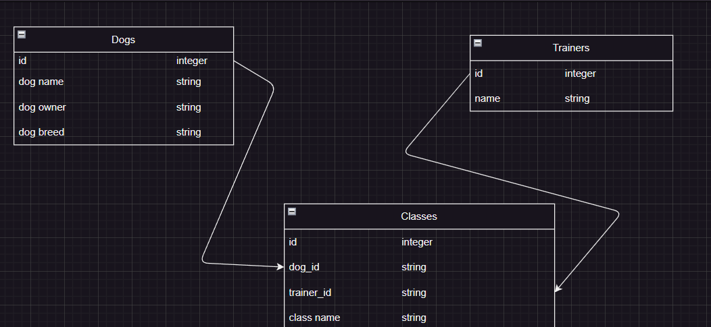
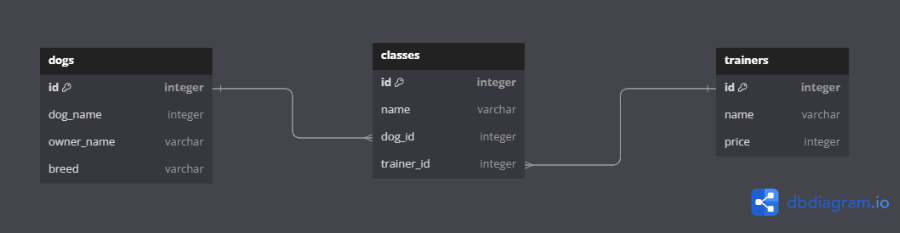

# PROJECT PITCH
### Owner/s: Katie Nowicki, Tyler Kim

### Phase and Cohort:  Phase 4/ SE111323


## One sentence app description:
App for dog training company to sign up new dogs, add new classes and trainers.

## Domain Model/ERD: 
<!--  -->




## MVP:
CRUD:

C. Add dogs, trainers, and classes

R. View dogs, classes, trainers

U. Update dog, classes, trainers

D. Delete dogs


## BACKEND (API)
### MODELS
* many-to-many relationship
* A `Dog` has many `Trainer`s through `Class`s
* A `Trainer` has many `Dog`s through `Class`s 
* A `Class` belongs to a `Dog` and belongs to a `Trainer`


### validations 
* Add validations to the `Dog` model:
* - must have a `name`
* Add validations to the `Class` model:
* - must have a 'name' 
* Add validations to the `Trainer` model:
  - must have a `price` between 1 and 100


## CONTROLLERS
​​API routes 
RESTful conventions 
```
GET /dogs/
POST /dogs/
```

```
GET /dogs/<int:id>
PATCH /dogs/<int:id>
DELETE /dogs/<int:id>
```
```
GET /classes/
POST /classes/
```
```
GET /trainers/<int:id>
PATCH /trainers/<int:id>
DELETE /trainers/<int:id>
```
```


### Serialize rules 
* 


FRONTEND (REACT)
Which components will make requests to your API? What route will the competent send fetch requests too? (i.e: ArtistForm, send a POST requests to /artists) 
-
-
-


EXTRA!
Stretch goals:
- Filter trainers based on price
- List trainers based on most classes held
- Create login feature
